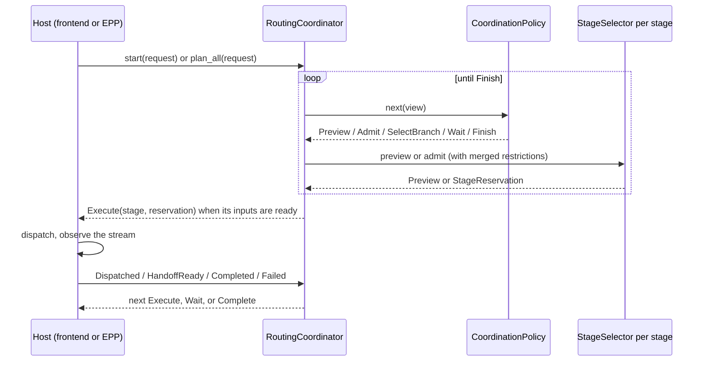

> [!WARNING]
> **Experimental.** The coordination policy API is new in this release. The contracts live in `dynamo_kv_router::coordination` and may change before they are declared stable.

## Overview

A request can run through more than one worker: an encode worker for multimodal input, a prefill worker, and a decode worker, or a single aggregated worker. The routing coordinator selects a worker for each of those *stages*, enforces the constraints between them, and hands each stage to the host once the stage's inputs are ready. The host (the Dynamo frontend or the gateway EPP) keeps dispatch, response streams, retries, and cleanup.

The coordinator does not replace worker selection. Within a stage, the selection core still runs its queue, eligibility, and Filter → Score → Pick policy (see [Write Custom Routing Strategies](custom-worker-selection.mdx)). The coordinator decides *which stage to select next, on which execution path, with which selection profile*, and *when an admitted stage may run*.

| Term | Meaning |
|---|---|
| Stage | A named step such as `prefill` or `decode`, bound to a worker pool through a `StageSelector`. |
| Topology | The execution paths (branches) a request may follow, the handoff dependencies between stages on each path, and the placement rules that connect stages. |
| Profile | The scoring mode and work accounting a stage uses for one selection, for example decode-only accounting with load-only scoring after a remote prefill. |
| Coordination policy | Compiled Rust that chooses the next operation: preview a stage, admit a stage, select a branch, wait for a handoff, or finish. |
| Reservation | An admitted worker plus the lease that releases it. A reservation has exactly one owner at a time: the coordinator's session, then the host. |
| Plan | Every stage of a request selected and reserved before anything runs; what the EPP exports as routing headers. |

## How a Request Flows



The frontend drives a session progressively: prefill executes as soon as it is admitted, decode is selected once prefill's handoff is ready, and the coordinator returns `Complete` when every reservation has moved to the host. The EPP calls `plan_all` instead, which selects every stage upfront and returns a `DelegatedPlan` or nothing.

## Built-In Topologies and Policies

| Topology | Branches | Default policy |
|---|---|---|
| `Topology::aggregated()` | `aggregated` | `aggregated`: admit one worker |
| `Topology::prefill_decode()` | `prefill → decode` | `progressive_prefill_decode` (frontend) or `prefill_first` (EPP) |
| `Topology::conditional_prefill_decode()` | `local_prefill_decode` or `remote_prefill_decode` | `conditional_disaggregation`: preview decode, decide, then run the chosen branch |
| `Topology::encode_prefill_decode()` | `encode → prefill → decode` or `prefill → decode` | `encode_prefill_decode` |

Registered policy names: `aggregated`, `prefill_first`, `decode_first`, `progressive_prefill_decode`, `conditional_disaggregation`, `encode_prefill_decode`. `decode_first` selects decode before prefill; execution still follows the topology, so prefill runs first and decode waits for its handoff.

Placement rules connect stages. `PlacementRule::TransferCompatible` reads each selected worker's published KV-transfer domain, enforcement, and weight and constrains later stages to compatible workers, in either selection order; `PlacementRule::SameDomain` requires or prefers a shared topology domain such as a rack. Both derive the same `dynamo.topology/<domain>=<value>` taints the router already matches, so no worker metadata changes are needed. See [Topology-Aware KV Transfer](topology-aware-kv-transfer.md).

## Where It Runs

| Host | Stages | Notes |
|---|---|---|
| Frontend (`dynamo.frontend`) | encode, prefill, decode | KV-routed prefill and decode sets use the coordinator; built-in (round-robin, random) hops keep the previous path. `DYN_ROUTER_STAGE_COORDINATOR=0` restores the previous path for KV hops for one release. |
| Runtime EPP (`DYN_EPP_MODE=dynamo`) | prefill, decode | `plan_all` books prefill and decode before the request leaves the EPP. Decode is admitted through the scheduler rather than queried and then registered separately. |
| Standalone EPP (`DYN_EPP_MODE=standalone`) | prefill, decode | Set `DYN_EPP_PREFILL_INFERENCE_POOL_NAME` to a second `InferencePool` of prefill workers. The EPP sets `x-prefiller-host-port` for the decode-side sidecar. See [Standalone Selection](standalone-selection.md). |

## Write a Coordination Policy

A policy implements `CoordinationPolicy` and derives its next operation from the read-only `CoordinationView`. Built-in policies keep no private progress counters, so a stage that a retry returns to `Pending` is simply admitted again. The example below selects decode before prefill and uses the decode-only profile for decode.

```rust
use async_trait::async_trait;
use dynamo_kv_router::coordination::{
    AdmissionIntent, CoordinationError, CoordinationOp, CoordinationPolicy,
    CoordinationPolicyRegistry, CoordinationView, ProfileName, StageId,
};

struct DecodeFirstThenPrefill;

#[async_trait]
impl CoordinationPolicy for DecodeFirstThenPrefill {
    async fn next(
        &mut self,
        view: &CoordinationView<'_>,
    ) -> Result<CoordinationOp, CoordinationError> {
        if !view.is_admitted(&StageId::DECODE) {
            return Ok(CoordinationOp::Admit(
                AdmissionIntent::new(StageId::DECODE).with_profile(ProfileName::DECODE_ONLY),
            ));
        }
        if !view.is_admitted(&StageId::PREFILL) {
            return Ok(CoordinationOp::Admit(AdmissionIntent::new(StageId::PREFILL)));
        }
        Ok(CoordinationOp::Finish)
    }
}

let mut registry = CoordinationPolicyRegistry::with_builtins(&kv_router_config);
registry.register(
    "decode_first_then_prefill",
    std::sync::Arc::new(|_facts| Box::new(DecodeFirstThenPrefill)),
)?;
let factory = registry.resolve("decode_first_then_prefill")?;
```

The view exposes the request facts (prompt length, whether an encoder must run, which stages the caller pinned), the chosen branch, each stage's status, preview, selected target and signals, and whether its handoff is ready. A policy that needs execution results returns `Wait`; one that does not should keep `supports_upfront_planning` true so the EPP can use it with `plan_all`.

Rules the coordinator enforces on every policy:

- `Finish` requires every stage on the chosen branch to be admitted.
- `Admit` from a preview reuses the previewed worker only while the preview is current: same pool generation, no newer selection when placement rules apply, and still permitted by the stage's restrictions.
- `Wait` is invalid during `plan_all`.
- A policy cannot dispatch work or change handoff dependencies; `Execute` actions come from the topology.

The compile-checked version of this example is [`coordination_policy_api.rs`](https://github.com/ai-dynamo/dynamo/blob/main/lib/kv-router/tests/coordination_policy_api.rs).

## Lifecycle Guarantees

| Situation | Behavior |
|---|---|
| Ownership transfer | `HostAction::Execute` and `DelegatedPlan` move the reservation out of the session. Dropping a reservation releases it; `release` waits for the scheduler. |
| Late or duplicate host events | Events name a stage attempt. Events for a superseded attempt are ignored; terminal transitions are idempotent. |
| Admission waits and reservation holds | `CoordinationLimits` bounds each selector call, total `plan_all` time, how long the session may hold an admitted reservation, and attempts per stage. Exceeding a limit releases everything the session owns. |
| Admission or placement failure | Every reservation the session holds is released; `plan_all` never returns a partial plan. |
| Retry | The host reports `Failed { retry: true }`; the coordinator re-admits the stage on a new attempt without the failed worker and re-selects dependents it still holds. |
| Client cancellation | Stages whose producer already reached a worker stay admitted so their handoff is consumed; everything else is released and no further stages are admitted. |

## Limitations

- Each stage selects one worker per attempt; splitting a stage across workers is not supported.
- Conditional disaggregation needs a decode stage whose selector supports previews; the EPP's prefill selector does not, and the EPP uses `prefill_first`.
- The standalone EPP's prefill pool selector does not join replica synchronization; prefill admission is local to each EPP replica.
- A single coordinator session that drives encode, prefill, and decode together requires the encode hop and the prefill/decode hop to share one pipeline operator; today the frontend runs the encode stage in its own session and hands the result to the prefill/decode session.
